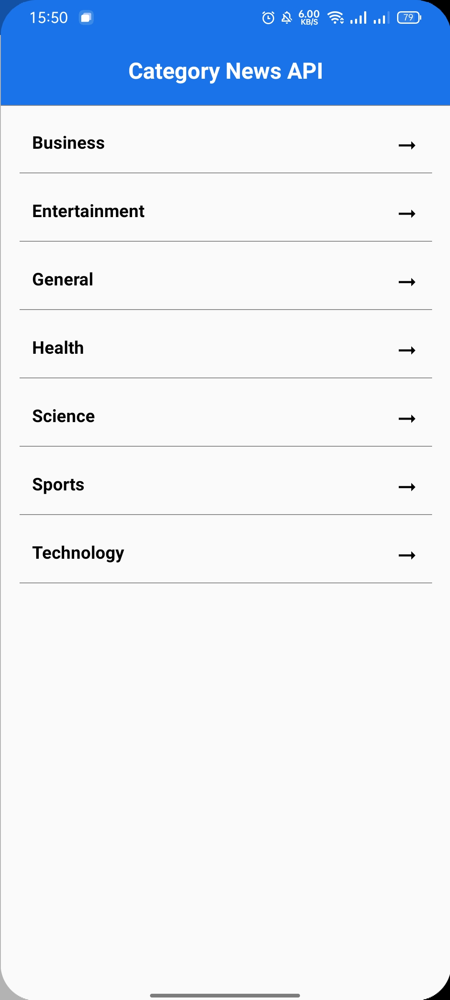

## Tentang Aplikasi

News API adalah aplikasi android untuk baca berita online menggunakan public api source dari <a href = "https://newsapi.org/">News API</a>
Aplikasi ini di bangun menggunakan :  
- [x] Kotlin sebagai bahasa Pemrogaman Utama</a>
- [x] XML sebagai UI Layout</a>
- [x] Desain Pattern MVVM</a>
- [x] Retrofit2 untuk networking dan konsumsi REST API</a>
- [x] Glide untuk Image Loader</a>

Aplikasi ini memiliki beberapa fitur :
- [x] Halaman Splash
- [x] Halaman Daftar Kategori
- [x] Halaman Daftar Headline
- [x] Halaman Daftar Berita
- [x] Halaman Detail Berita

## Preview Aplikasi

